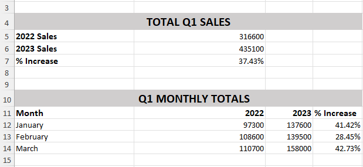
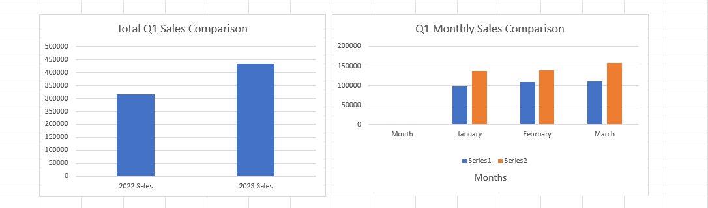

# 📊 Q1 Sales Executive Summary – Excel
### Microsoft Power BI Data Analyst - Portfolio Project

---

## 📑 Table of Contents
- [Overview](#overview)
- [Business Task](#business-task)
- [Dataset Detail](#dataset-detail)
- [Tools--technologies-used](#tools--technologies-used)
- [Skills-demonstrated](#skills-demonstrated)
- [Project-workflow](#project-workflow)
- [Results](#results)
- [Key-findings](#key-findings)
- [About-this-project](#about-this-project)

---

## 🧭 Overview
This project focuses on building an **executive-level Q1 sales summary** using Microsoft Excel.  
The analysis compares **Q1 sales performance for 2022 and 2023**, highlighting year-over-year growth, monthly trends, and clear visual insights suitable for management decision-making.

---

## 🎯 Business Task
The objective was to prepare a **clear and concise executive summary** that:
- Calculates **total Q1 sales** for two consecutive years
- Compares **year-over-year performance**
- Breaks down sales by **month (January–March)**
- Presents insights in a **management-friendly format**

---

## 🗂️ Dataset Detail
- **Source:** Adventure Works – Quarter One Report  
- **Format:** Microsoft Excel (`.xlsx`)
- **Scope:** Product-level transactional sales data
- **Key Fields:**
  - Product details
  - Order Date, Month, Year
  - Retail & Wholesale Prices
  - Order Quantity
  - Order Total & Tax Information

---

## 🛠️ Tools & Technologies Used
- **Microsoft Excel**

---

## 🧠 Skills Demonstrated
- Data cleaning & preparation  
- Excel formulas (`SUMIFS`, `IF`, percentage calculations)  
- Year-over-year (YoY) analysis  
- Monthly trend analysis  
- Executive reporting & storytelling  
- Data visualization best practices  

---

## 🔄 Project Workflow
1. **Raw Data Preservation**
   - Maintained original dataset in a dedicated raw data sheet
   - Ensured data integrity and reproducibility

2. **Data Preparation**
   - Standardized text formatting
   - Validated dates, month, and year fields
   - Verified calculated sales and tax values

3. **Executive Summary Creation**
   - Calculated total Q1 sales for 2022 and 2023 using `SUMIFS`
   - Computed percentage increase (YoY growth)
   - Built monthly sales breakdown for Q1

4. **Visualization**
   - Created comparison charts for total and monthly sales
   - Organized visuals on a separate executive charts sheet

5. **Presentation & Documentation**
   - Structured outputs for portfolio use
   - Saved final results and visuals for GitHub presentation

---

## 📊 Results

| 1. Q1 Sales Executive Summary |
|-------------------------------|
|  |
| Executive-level summary table presenting total Q1 sales, monthly breakdown, and year-over-year percentage growth for 2022 and 2023. |

---

| 2. Q1 Sales Comparison (2022 vs 2023) |
|--------------------------------------|
|  |
| Combined visualizations comparing total and monthly Q1 sales performance between 2022 and 2023, highlighting clear year-over-year growth trends. |

---

## 🔍 Key Findings
- **Q1 2023 sales increased by ~37%** compared to Q1 2022
- Consistent growth observed across **all three months**
- March recorded the **highest year-over-year increase**
  
---

## ℹ️ About This Project
- This project was completed as the **final course project** for  **Course 01 – Preparing Data for Analysis with Microsoft Excel**, part of the **Microsoft Power BI Data Analyst Professional Certificate**.
- It demonstrates how Excel can be used to transform raw transactional data into **clear, executive-ready insights** suitable for business reporting and decision-making.
